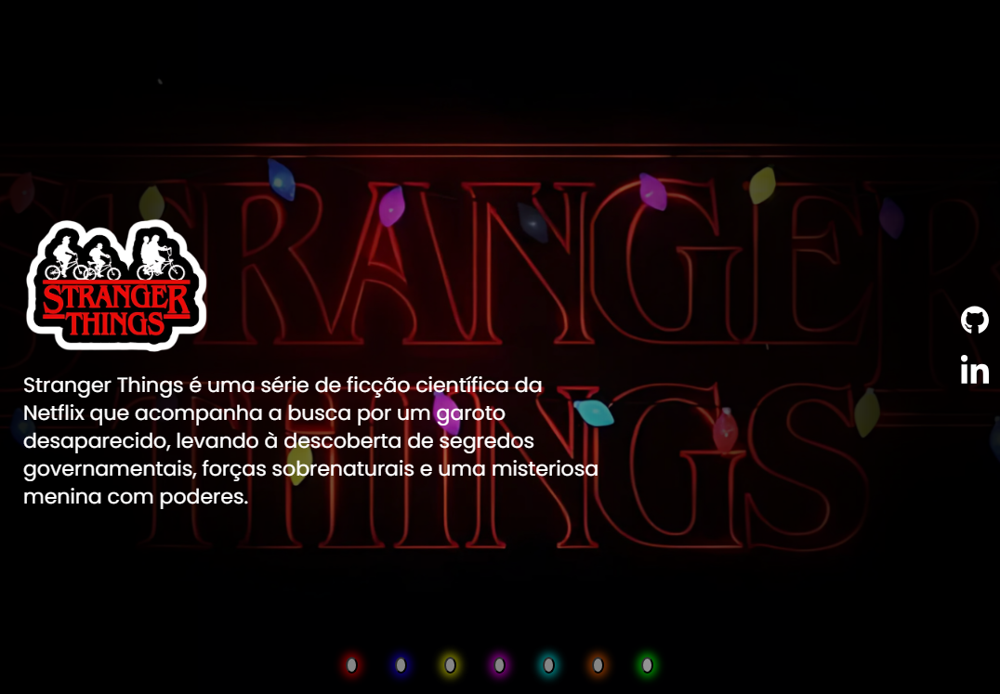

# Stranger Things - Carrossel de Pôsteres 🚲🌀🎬

Este projeto recria o universo de **Stranger Things** com um carrossel interativo de pôsteres das temporadas da série. Com **HTML**, **CSS** e **JavaScript**, os usuários podem visualizar os pôsteres de cada temporada de forma dinâmica, passando de um para o outro de maneira interativa e visualmente envolvente.

Desenvolvido como parte do desafio da comunidade **[@Dev Em Dobro](https://github.com/devemdobro)** e da **Guild Dev Em Dobro**, durante a **Mapa Dev Week**.

---

## Índice

- [Objetivo do Projeto](#objetivo-do-projeto-)
- [Tecnologias Utilizadas 🛠️](#tecnologias-utilizadas-)
- [Estrutura do Projeto 📂](#estrutura-do-projeto-)
- [Descrição dos Arquivos 📄](#descrição-dos-arquivos-)
- [Funcionalidades 🌟](#funcionalidades-)
- [Capturas de Tela 🎨](#capturas-de-tela-)
- [Como Usar 🚀](#como-usar-)
- [Links Úteis 🌐](#links-úteis-)
- [Testes 🔍](#testes-)
- [Contribuição 🤝](#contribuição-)
- [Licença 📜](#licença-)
- [Agradecimentos 🙏](#agradecimentos-)
- [Melhorias Futuras 🚧](#melhorias-futuras-)

---

## Objetivo do Projeto

Criar uma experiência interativa com um carrossel de imagens que apresenta os pôsteres de cada temporada da série **Stranger Things**. O projeto permite que os usuários naveguem pelas temporadas de forma dinâmica e visualmente interessante.

---

## Tecnologias Utilizadas 🛠️

- **HTML**: Estruturação do conteúdo e layout da página do carrossel.
- **CSS**: Estilos para a apresentação visual do carrossel, animações e transições.
- **JavaScript**: Lógica para controlar a navegação entre os pôsteres das temporadas.

---

## Estrutura do Projeto 📂

```
├── src
│   ├── css
│   │   └── style.css
│   ├── imagens
│   │   ├── posters-stranger-things
│   └── js
│       └── index.js
├── index.html
└── README.md
```

---

## Descrição dos Arquivos 📄

- **style.css**: Estilos principais da página, incluindo a aparência do carrossel e animações de transição.
- **index.js**: Lógica JavaScript que controla a navegação entre os pôsteres e a funcionalidade do carrossel.
- **imagens/**: Pasta contendo as imagens dos pôsteres das diferentes temporadas da série.
- **index.html**: Arquivo HTML principal que exibe o carrossel de pôsteres.

---

## Funcionalidades 🌟

- **Carrossel de Pôsteres:** Permite que os usuários naveguem pelos pôsteres de cada temporada de **Stranger Things** de forma interativa.
- **Interface Responsiva:** A página foi otimizada para funcionar bem em diferentes dispositivos, oferecendo uma experiência fluida tanto em desktop quanto em dispositivos móveis.
- **Animações e Transições:** O carrossel tem transições suaves entre os pôsteres, com efeitos visuais que melhoram a experiência do usuário.

---

## Capturas de Tela 🎨

Aqui está um imagem do projeto, mostrando como o carrossel de pôsteres aparece:



---

## Como Usar 🚀

1. Clone este repositório:
   ```bash
   git clone https://github.com/seunome/stranger-things-carrossel.git
   ```
2. Navegue até a pasta do projeto:
   ```bash
   cd stranger-things-carrossel
   ```
3. Abra o arquivo `index.html` em seu navegador para visualizar o carrossel.

---

## Links Úteis 🌐

- Visualizar o projeto: [Stranger Things - Carrossel de Pôsteres](https://paulapsox.github.io/stranger-things/)
- Repositório no GitHub: [seunome/stranger-things-carrossel](https://github.com/paulaPSOx/stranger-things) 

---

## Testes 🔍

Para testar o projeto:
1. Verifique se todos os arquivos estão carregados corretamente.
2. Navegue pelos pôsteres e teste a transição entre eles.
3. Teste a responsividade em diferentes dispositivos (desktop, tablet, smartphone).

---

## Licença 📜

Este projeto é licenciado sob a MIT License - veja o arquivo [LICENSE](https://github.com/seunome/stranger-things-carrossel/LICENSE) para mais detalhes.

---

## Agradecimentos 🙏

Agradeço à comunidade **[@Dev Em Dobro](https://github.com/devemdobro)** e à **Guild Dev Em Dobro** pelo apoio e recursos durante o desenvolvimento deste projeto na **Mapa Dev Week**!

---

## Melhorias Futuras 🚧

- Adicionar descrições interativas para cada pôster de temporada.
- Implementar uma funcionalidade de autoplay no carrossel.
- Melhorar a acessibilidade da interface para usuários com deficiências visuais.

---

Espero que você curta explorar o carrossel de pôsteres de **Stranger Things** e se divirta com a série de uma maneira nova! 🔮✨
